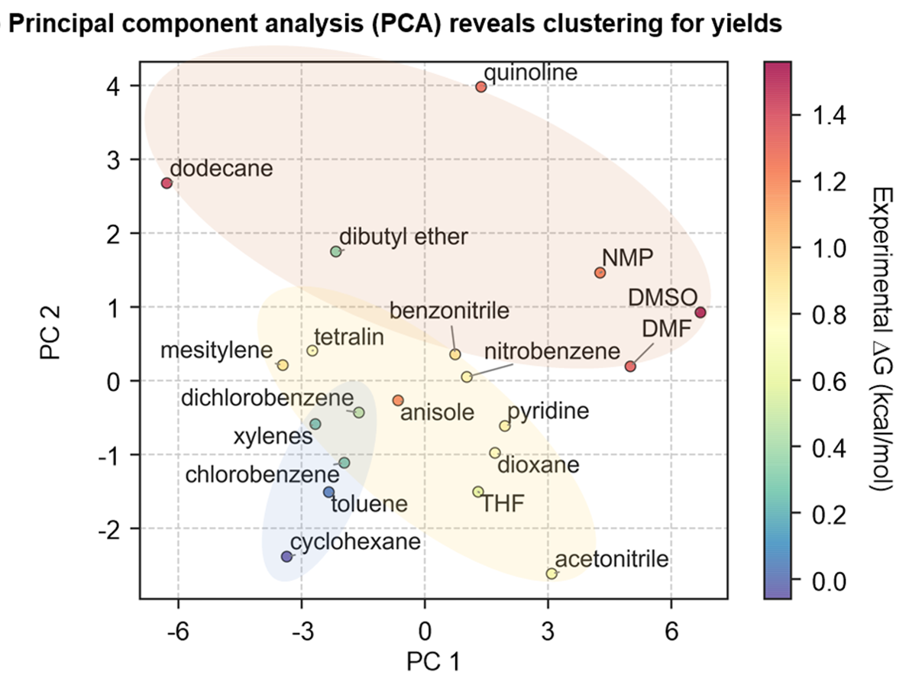
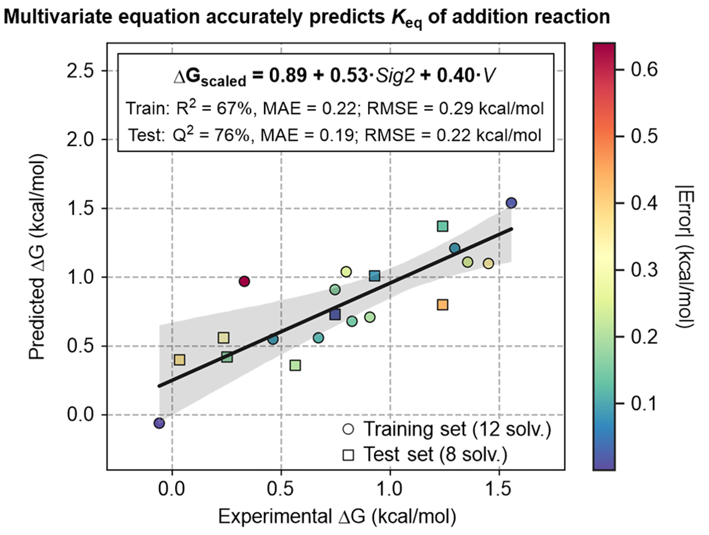

# Solvent_regression_analysis
A repository for the 20 solvents studied experimentally on the base-batalyzed anti-Markovnikov alcohol addition reaction1. This study includes a principal component analysis (PCA) to visualize the variation between the molecular descriptors and the prediction of equilibrium yields with a multivariate linear regression model. The dataset includes the measured equilibrium constants and a set of 17 molecular descriptors that capture electronic and structural differences. 

The descriptors include: 
* Hansen solubility parameters2
* Abraham solvation parameters3 
* elements of the Minnesota Solvent Descriptor Database4
* computed COSMO-RS moments5

### Dependencies:
* The following packages are required to run the jupyter notebook: numpy, pandas, matplotlib, seaborn, adjustText and scikit-sklearn.
* To run the R script, the program R (Download at https://cran.r-project.org/mirrors.html – choose any mirror link) and R Studio (Download at https://www.rstudio.com/products/rstudio/download/) will be required. The R packages required include: dplyr, corrplot, cvq2, car, ggplot2, cowplot, MuMIn, and Metrics.

### Showcased Results:

    <b>Figure a. PCA plot</b>

    <b>Fibure b. MV linear regression model</b>

### References:
1. Luo, C.; Bandar, J. S. Superbase-Catalyzed anti-Markovnikov Al-cohol Addition Reactions to Aryl Alkenes. J. Am. Chem. Soc. 2018, 140, 3547–3550. (https://pubs.acs.org/doi/10.1021/jacs.8b00766)
2. Benazzouz, A.; Moity, L.; Pierlot, C.; Sergent, M.; Molinier, V.; Aubry, J-M. Selection of a greener set of solvents evenly spread in the Hansen space by space-filling design. Ind. Eng. Chem. Res. 2013, 52, 16585–16797. (https://pubs.acs.org/doi/abs/10.1021/ie402410w)
3. Zissimos, A. M.; Abraham, M. H.; Klamt, A.; Eckert, F.; Wood, J. A Comparison between the two general sets of linear free energy descriptors of Abraham and Klamt. J. Chem. Inf. Comput. Sci. 2002, 42, 1320–1331. (https://pubs.acs.org/doi/10.1021/ci025530o)
4. Winget, P.; Dolney, D. M.; Giesen, D. J.; Cramer, C. J.; Truhlar, D. G. Minnesota Solvent Descriptor Database. University of Min-nesota, Minneapolis, USA. Version date: July 9, 1999; updated: June 6, 2010. (https://comp.chem.umn.edu/solvation/mnsddb.pdf)
5. (a) Klamt, A. Conductor-like screening model for real solvents: a new approach to the quantitative calculation of solvation phe-nomena. J. Phys. Chem. 1995, 99, 2224–2235; (b) Klamt, A.; Jonas, V.; Bürger, T.; Lohrenz, J. C. Refinement and parametriza-tion of COSMO-RS. J. Phys. Chem. A 1998, 102, 5074–5085; (c) COSMOtherm Version 18.0.0 (Revision 4360), COSMOlogic GmbH & Co KG; (d) Eckert, F.; Klamt, A. Fast solvent screening via quantum chemistry: COSMO-RS approach. AIChE J. 2002, 48, 369–385; (d) TURBOMOLE, version 7.2.1, University of Karls-ruhe and Forschungszentrum Karlsruhe GmbH, 1989-2007, TURBOMOLE GmbH, since 2007. 
